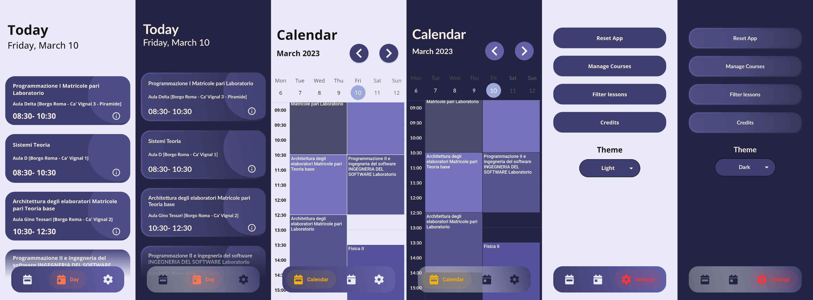

# UniTime

UniTime is an application that started during university years due to the lack of a way to quickly view class schedules. The main goal of UniTime is to provide a clear and simple view of academic commitments, helping students organize their time more efficiently. Thanks to its intuitive interface, users can easily add their courses and view schedules in a clear and detailed manner. UniTime also offers the option to add multiple courses together and view schedules in daily or weekly view.

#
## UniTime is now available for various universities and can be downloaded on

## Some basic view screens

